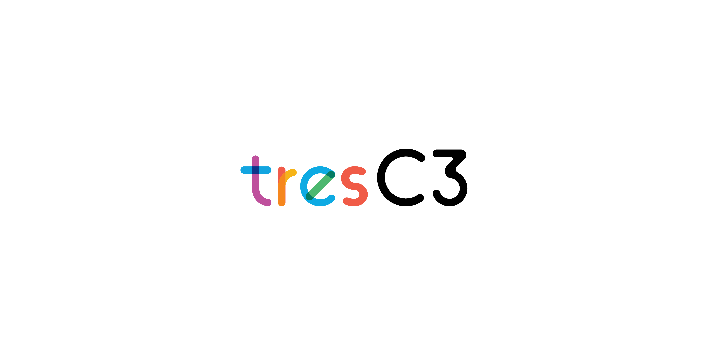

# connectwo-controller
##### Tresc3 mobile robot base controller

***

 

***

 

> I cannot give you the fomular for success, but I can give you the formula for failure-Which is: Try to please everybody. -H. B. Swope -

* Toolchain: stm32cubeide
* Chip: stm32f446re
* com:
  * USB_OTG_FS
  * USB to TTL logic
  * 2 * UART
  * MAX232
  * CAN
  * I2C
* 5V input
* 4 * ADC
* 4 * motor (PWM, DIR, ENCODER enabled)